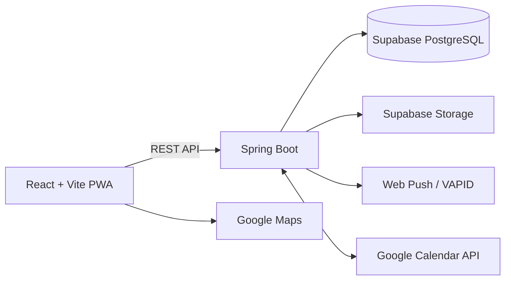

<p align="center">
  
</p>

# DANDUL

DANDUL is a private, mobile-first archive for two people to collect schedules,
photos, videos, comments, milestones, and hiking memories in one shared place.
It began as a personal tool and grew through continuous feedback from its two
real users.

> This repository is an automatically updated, sanitized portfolio mirror.
> Production credentials, personal media, and private deployment data are not
> included.

## Highlights

- **HOME**: relationship milestones, birthdays, upcoming anniversaries, and favorite memories
- **CALENDAR**: month view, date-range events, categories, Korean holidays, and event detail editing
- **Google Calendar**: dedicated DANDUL calendar with two-way event synchronization
- **ALBUM**: responsive 3-column media gallery, photo/video upload, favorites, carousel viewing, and comments
- **HIKING**: BAC 100 mountain reference data, personal hiking history, elevation summaries, and map markers
- **PWA**: installable mobile experience, custom in-app splash image cropping, and Web Push notifications
- **ADMIN**: period-based monitoring for posts, comments, couple schedules, and visits
- **Korea time**: all user-facing dates and action timestamps use `Asia/Seoul`

## Architecture



## Tech Stack

| Area | Technology |
| --- | --- |
| Frontend | React 19, Vite, CSS, Lucide Icons |
| Backend | Spring Boot 4, Java 21, Gradle |
| Database | PostgreSQL on Supabase, Spring Data JPA, Flyway |
| Storage | Supabase Storage |
| Integration | Google Calendar API, Google Maps JavaScript API |
| Notifications | Web Push, VAPID, Service Worker |
| Deployment | Vercel, Render, Docker |

## Project Structure

```text
.
|-- frontend/                 # React + Vite client and PWA assets
|-- backend/                  # Spring Boot REST API
|   `-- src/main/resources/db/migration/
|-- docs/                     # Portfolio assets
|-- render.yaml               # Render Blueprint
|-- vercel.json               # Vercel configuration
`-- README.md
```

## Local Development

### Backend

```powershell
cd backend
$env:APP_LOGIN_PASSWORD='your-local-password'
.\gradlew.bat bootRun
```

Without Supabase variables, the backend uses H2 and local file storage. It runs
at `http://localhost:8080`.

### Frontend

```powershell
cd frontend
npm install
npm run dev
```

The frontend runs at `http://localhost:3000` and proxies local API requests to
the backend.

## Environment Variables

Use the checked-in `.env.example` files as templates. Important production
variables include:

```text
# Frontend
VITE_API_BASE_URL=
VITE_GOOGLE_MAPS_API_KEY=

# Backend
APP_LOGIN_PASSWORD=
SUPABASE_DB_URL=
SUPABASE_DB_USERNAME=
SUPABASE_DB_PASSWORD=
SUPABASE_URL=
SUPABASE_SERVICE_ROLE_KEY=
SUPABASE_STORAGE_BUCKET=
APP_PUSH_VAPID_PUBLIC_KEY=
APP_PUSH_VAPID_PRIVATE_KEY=
GOOGLE_CLIENT_ID=
GOOGLE_CLIENT_SECRET=
GOOGLE_REDIRECT_URI=
```

Never expose service-role, OAuth client-secret, database, or VAPID private keys
in frontend variables.

## Verification

```powershell
cd frontend
npm run build

cd ..\backend
.\gradlew.bat test
```

## Portfolio Mirror

Every push to the private source repository's `main` branch runs a GitHub
Actions export. The export copies only tracked source files, replaces the
private splash photo with a generic portfolio asset, removes private migration
utilities and deployment notes, and rewrites authentication configuration to
use `APP_LOGIN_PASSWORD`.
